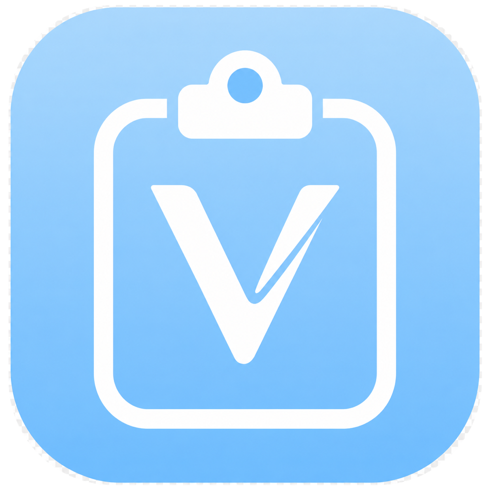
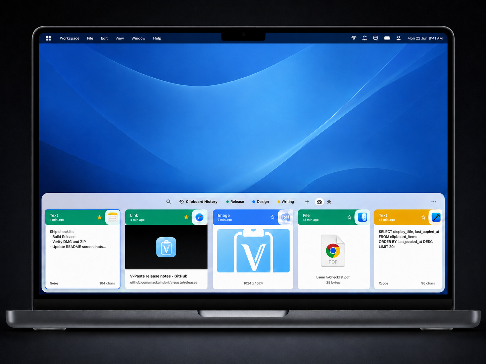
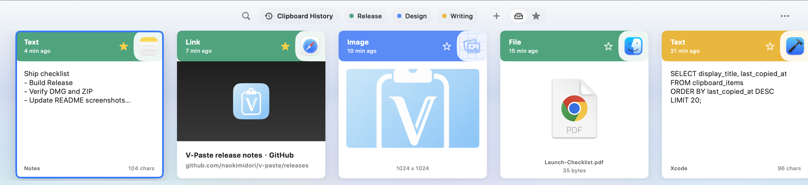

<div align="center">
  
  <h1>V-Paste</h1>
  <p><strong>A fast, local-first clipboard history app for macOS.</strong></p>
  <p>
    <a href="README.md">English</a> ·
    <a href="README-CN.md">简体中文</a>
  </p>
  <p>
    <a href="https://github.com/naokimidori/v-paste/releases"></a>
    
    
    
    <a href="LICENSE"></a>
  </p>
  
</div>

V-Paste keeps your clipboard history close at hand without turning it into somebody else's data. It sits quietly in the menu bar, watches text, links, files, and images, then opens a keyboard-friendly bottom panel whenever you need to find something again.

## Inspiration

V-Paste is inspired by [Paste](https://pasteapp.io/), especially its visual clipboard workflow, searchable history, and polished Mac-first interaction model. V-Paste is an independent open-source project, is not affiliated with Paste, and focuses on a local-first macOS implementation.

## Quick Links

- [Download](#download)
- [Highlights](#highlights)
- [Screenshots](#screenshots)
- [Inspiration](#inspiration)
- [Privacy model](#privacy-model)
- [Build from source](#build-from-source)
- [Release notes](CHANGELOG.md)

## Why V-Paste

Clipboard managers are useful because they remember what you forget. They are risky for the exact same reason. V-Paste is built around a simple principle: your clipboard history should be useful, searchable, and still stay on your Mac.

| Area | What V-Paste gives you |
| --- | --- |
| Fast recall | A floating bottom panel with search, keyboard navigation, and one-click paste-back. |
| Real item types | Text, URLs, copied files, and images are rendered as distinct cards instead of one generic list. |
| Useful context | Source app names, timestamps, link previews, favicons, image sizes, and file metadata. |
| Organization | Favorites and groups keep important snippets from disappearing into the stream. |
| Privacy controls | Local SQLite storage, retention settings, clear-history actions, and monitoring controls. |
| Native Mac feel | Menu bar presence, global shortcut, launch-at-login, SwiftUI views, AppKit window behavior. |
| Lightweight footprint | A focused native app without account flows, cloud sync services, or heavyweight runtime dependencies. |

## Highlights

- **Instant panel:** Press the global shortcut and V-Paste slides up as a focused clipboard command center.
- **Search that respects flow:** Filter history by text, URLs, file names, group names, and source metadata.
- **Rich previews:** URL cards can show page titles and favicons; image cards show thumbnails and pixel dimensions.
- **Favorites and groups:** Pin items that matter and move reusable snippets into named groups.
- **Local-first storage:** Clipboard history is stored under your macOS Application Support directory.
- **Lightweight by default:** V-Paste keeps the app surface focused and avoids cloud service dependencies.
- **No account required:** No cloud account, no hosted V-Paste backend, and no analytics service in this repository.

## Screenshots

### Clipboard Panel



## Download

Download the latest public build from [GitHub Releases](https://github.com/naokimidori/v-paste/releases/latest).

Current release assets are preview builds. They are useful for testing the open-source baseline, but they are not yet signed and notarized for polished public distribution. If macOS blocks the downloaded app, build from source or create a signed/notarized build with your own Apple Developer identity.

Default workflow:

1. Download the DMG or ZIP from the latest release.
2. Launch `V-Paste.app`.
3. Use the menu bar icon or press `Option + ~` to open the clipboard panel.
4. Open Settings to adjust retention, launch-at-login, monitoring, and the show-panel shortcut.

## Privacy Model

V-Paste is local-first by design. Clipboard records are stored on your Mac under the app's Application Support directory:

```text
~/Library/Application Support/io.vpaste.app/
```

The app may store clipboard text, copied file paths, image assets, thumbnails, link preview titles, favicons, source app names, source app bundle identifiers, timestamps, favorites, groups, and retention metadata.

When a copied item is a web URL, V-Paste may fetch the page and favicon to create a local link preview. It does not need an account, does not upload clipboard history to a V-Paste service, and does not include analytics or telemetry collection in this repository.

Read the full data-handling notes in [PRIVACY.md](PRIVACY.md).

## Build From Source

Requirements:

- macOS 14 or newer
- Xcode with the macOS SDK
- Swift toolchain included with Xcode

Clone and run:

```bash
git clone https://github.com/naokimidori/v-paste.git
cd v-paste
./script/build_and_run.sh
```

Useful development modes:

```bash
./script/build_and_run.sh run
./script/build_and_run.sh --logs
./script/build_and_run.sh --telemetry
./script/build_and_run.sh --verify
```

Run tests:

```bash
xcodebuild test \
  -project V-Paste.xcodeproj \
  -scheme V-Paste \
  -configuration Debug \
  -destination 'platform=macOS' \
  -derivedDataPath build/DerivedData
```

Package a local release build:

```bash
./script/package_release.sh
```

The packaging script writes unsigned local artifacts to `dist/`. Set `CODESIGN_IDENTITY` to sign the staged app, and set both `CODESIGN_IDENTITY` and `NOTARY_PROFILE` to submit and staple the DMG during packaging. See [docs/release.md](docs/release.md) for the release checklist.

## Project Structure

```text
V-Paste/                  App source
  App/                    Application lifecycle and state wiring
  Domain/                 Clipboard models and value types
  Infrastructure/         Clipboard, SQLite, file cache, and hotkey services
  Support/                Shared support utilities
  UI/                     Menu bar, panel, cards, and settings views
V-PasteTests/             XCTest coverage
script/                   Local build and packaging helpers
docs/                     Public documentation and README assets
```

## Roadmap

- Signed and notarized release artifacts.
- More granular app and content ignore rules.
- Import/export for reusable snippets.
- Additional search filters and keyboard actions.
- More polished onboarding for first-time users.

## Contributing

Contributions are welcome. Please read [CONTRIBUTING.md](CONTRIBUTING.md) before opening a pull request.

Good first areas include UI polish, accessibility, test coverage, packaging automation, and privacy-focused filtering controls.

## License

V-Paste is released under the [MIT License](LICENSE).
